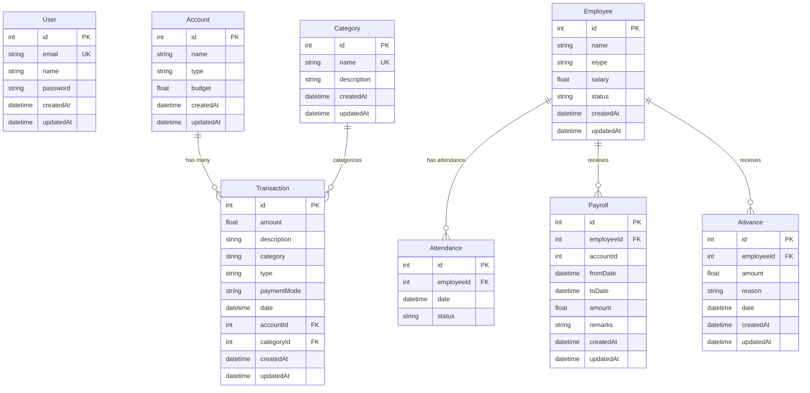

# Entity-Relationship Diagram - BrickBook Ledger

## Database Schema Overview



## Entity Details

### 1. **User**
- **Purpose**: System authentication
- **Fields**: id, email (unique), name, password, timestamps
- **Relationships**: None (independent entity)

### 2. **Account**
- **Purpose**: Financial accounts management (Cash, Bank, etc.)
- **Fields**: id, name, type (General/Bank/Cash), budget, timestamps
- **Relationships**: 
  - One-to-Many with Transaction

### 3. **Category**
- **Purpose**: Transaction categorization (Salary, Materials, etc.)
- **Fields**: id, name (unique), description, timestamps
- **Relationships**: 
  - One-to-Many with Transaction

### 4. **Transaction**
- **Purpose**: Core financial transactions tracking
- **Fields**: id, amount, description, category, type, paymentMode, date, accountId, categoryId, timestamps
- **Relationships**: 
  - Many-to-One with Account (accountId)
  - Many-to-One with Category (categoryId, optional)

### 5. **Employee**
- **Purpose**: Employee master data
- **Fields**: id, name, etype (type), salary, status (Active/Inactive), timestamps
- **Relationships**: 
  - One-to-Many with Attendance
  - One-to-Many with Payroll
  - One-to-Many with Advance

### 6. **Attendance**
- **Purpose**: Daily employee attendance tracking
- **Fields**: id, employeeId, date, status (Present/Absent/Half Day)
- **Relationships**: 
  - Many-to-One with Employee (with cascade delete)
- **Constraints**: Unique constraint on (employeeId, date)

### 7. **Payroll**
- **Purpose**: Employee salary payment records
- **Fields**: id, employeeId, accountId, fromDate, toDate, amount, remarks, timestamps
- **Relationships**: 
  - Many-to-One with Employee

### 8. **Advance**
- **Purpose**: Salary advance/loan tracking
- **Fields**: id, employeeId, amount, reason, date, timestamps
- **Relationships**: 
  - Many-to-One with Employee

## Key Relationships Summary

```
User (1) --- Independent --- Authentication Only

Account (1) --< (n) Transaction
Category (1) --< (n) Transaction

Employee (1) --< (n) Attendance
Employee (1) --< (n) Payroll  
Employee (1) --< (n) Advance
```

## Database Constraints

1. **Unique Constraints**:
   - User.email
   - Category.name
   - Attendance(employeeId, date) - composite unique

2. **Cascade Rules**:
   - Employee deletion → Cascades to Attendance (onDelete: Cascade)

3. **Default Values**:
   - Account.type = "General"
   - Account.budget = 0
   - Transaction.paymentMode = "G-Pay"
   - Employee.status = "Active"

## Schema Statistics

- **Total Entities**: 8
- **Total Relationships**: 6
- **Foreign Keys**: 7
- **Unique Constraints**: 3
